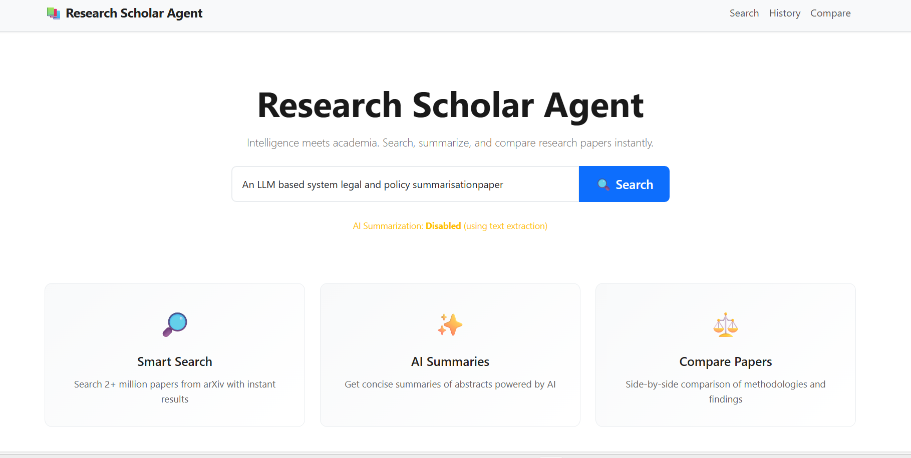

# Research Scholar Agent 📚
## AI-Powered Academic Research Assistant

A sophisticated web application that helps researchers search for papers, generate AI-powered summaries, and compare research papers side-by-side.



---

## Features ✨

- **🔍 Smart Paper Search**: Search 2+ million papers from arXiv by topic
- **✨ AI-Powered Summaries**: Generate concise 3-4 line summaries using OpenAI GPT-3.5
- **📊 Paper Comparison**: Analyze two papers side-by-side with methodology and conclusion comparison
- **💾 Search History**: Automatically save and revisit previous searches
- **🎨 Clean Interface**: Academic-themed UI with Bootstrap 5
- **⚡ Fast & Reliable**: Lightweight, responsive design

---

## Tech Stack

- **Backend**: Python, Flask
- **Database**: SQLite (lightweight, no setup needed)
- **APIs**: arXiv API, OpenAI API
- **Frontend**: HTML5, CSS3, Bootstrap 5
- **Environment**: Virtual Environment (venv)

---

## Project Structure

```
research_scholar_agent/
├── app.py                 # Main Flask application
├── database.py            # Database operations
├── requirements.txt       # Python dependencies
├── .env.example          # Environment variables template
│
├── modules/
│   ├── __init__.py
│   ├── search.py         # arXiv API integration
│   ├── summarize.py      # AI summarization
│   └── compare.py        # Paper comparison logic
│
├── templates/
│   ├── index.html        # Home/search page
│   ├── results.html      # Search results display
│   ├── history.html      # Search history
│   ├── compare.html      # Comparison view
│   └── compare_select.html # Paper selection for comparison
│
└── static/
    └── style.css         # Custom styling
```

---

## Installation & Setup

### 1. Prerequisites

- Python 3.8+ installed
- pip (Python package manager)
- Internet connection (for API access)

### 2. Clone/Download Project

```bash
# Navigate to your Research Scholar Agent folder
cd "c:\Users\hp\Research Scholar Agent\research_scholar_agent"
```

### 3. Create Virtual Environment

```bash
# Windows (PowerShell)
python -m venv venv
.\venv\Scripts\Activate.ps1

# Windows (Command Prompt)
python -m venv venv
venv\Scripts\activate

# Linux/Mac
python3 -m venv venv
source venv/bin/activate
```

### 4. Install Dependencies

```bash
pip install -r requirements.txt
```

### 5. Configure Environment (Optional but Recommended)

#### Option A: Using .env file (Recommended)

1. Copy `.env.example` to `.env`:
```bash
# Windows
copy .env.example .env

# Linux/Mac
cp .env.example .env
```

2. Edit `.env` and add your OpenAI API key:
```
OPENAI_API_KEY=sk-your-actual-api-key-here
```

Get your OpenAI API key from: https://platform.openai.com/account/api-keys

#### Option B: Set Environment Variable Directly

**Windows (PowerShell):**
```powershell
$env:OPENAI_API_KEY = "sk-your-api-key-here"
```

**Windows (Command Prompt):**
```cmd
set OPENAI_API_KEY=sk-your-api-key-here
```

**Linux/Mac:**
```bash
export OPENAI_API_KEY="sk-your-api-key-here"
```

### 6. Run the Application

```bash
python app.py
```

You should see:
```
╔════════════════════════════════════════════════════════════╗
║   Research Scholar Agent - AI Academic Assistant          ║
║   URL: http://localhost:5000                              ║
║   Press Ctrl+C to stop the server                         ║
╚════════════════════════════════════════════════════════════╝
```

### 7. Open in Browser

Navigate to: **http://localhost:5000**

---

## Usage Guide

### Searching Papers

1. **Enter a topic** in the search bar (e.g., "machine learning", "quantum computing")
2. **Click Search** to fetch top 5 papers from arXiv
3. **View results** with titles, authors, years, and AI summaries
4. **Click "View Full Abstract"** to see complete abstracts
5. **Click "📖 Read Paper"** to open the paper on arXiv

### Comparing Papers

**Method 1: From Search Results**
1. Perform a search
2. Select two papers using the dropdowns in the "Compare Papers" section
3. Click the **⚖️ Compare** button
4. View side-by-side analysis

**Method 2: From History**
1. Go to **History** page
2. Click on a previous search
3. Use dropdowns to select papers
4. Click **Compare**

### Comparing View Shows:
- **Paper titles, authors, publication year**
- **Extracted methodology** from each paper
- **Key conclusions** identified by AI
- **AI-generated summaries**
- **Full abstracts** (expandable)
- **Comparison table** for quick reference

### Viewing Search History

1. Click **History** in navigation
2. View all your previous searches
3. Click on any search to see those results again
4. Each entry shows paper count and timestamp

---

## Features Explained

### AI Summarization
- **With OpenAI API**: Generates concise 3-4 line summaries
- **Without API Key**: Uses intelligent fallback (first 2 sentences extraction)

### Paper Search
- **Source**: arXiv academic repository (2+ million papers)
- **Relevance**: Results sorted by relevance (most recent first)
- **Limit**: Returns top 5 papers per search (configurable)

### Comparison Analysis
- **Methodology Extraction**: Identifies research methods used
- **Conclusion Analysis**: Extracts key findings
- **Side-by-Side Layout**: Easy visual comparison
- **Metadata Comparison**: Years, authors, publication details

---

## Configuration

### Modify Search Results Limit

Edit `app.py`, line ~110:
```python
papers = search_papers(query, max_results=5)  # Change 5 to desired number
```

### Change Port

Edit `app.py`, last line:
```python
app.run(debug=True, host='127.0.0.1', port=5000)  # Change 5000 to desired port
```

### Enable/Disable AI Summarization

Edit `app.py`, line ~125:
```python
paper['summary'] = summarize_text(paper.get('abstract', ''), use_ai=True)  # Set to False to disable
```

---

## Troubleshooting

### Port 5000 Already in Use
```bash
# Windows: Find and kill process
netstat -ano | findstr :5000
taskkill /PID <PID> /F

# Linux/Mac: Find and kill process
lsof -i :5000
kill -9 <PID>
```

### arXiv API Not Responding
- The arXiv API might be temporarily down
- Try again in a few moments
- Check your internet connection

### OpenAI API Errors
- Verify your API key is correct
- Check you have account balance
- Verify API key has correct permissions
- The app will work without API key (text extraction fallback)

### Database Locked Error
```python
# Stop the app and delete database file to reset
rm research_papers.db
# Restart the app
```

---

## API Endpoints (Advanced)

### Search Papers
```
POST /search
- Parameters: query (string)
- Returns: Rendered results page
```

### Get Search History
```
GET /history
- Returns: History page with all searches
```

### Compare Papers
```
POST /compare
- Parameters: paper1 (int), paper2 (int)
- Returns: Comparison page
```

### API: Recent Searches
```
GET /api/recent-searches
- Returns: JSON list of recent queries
```

---

## Environment Variables

| Variable | Required | Description |
|----------|----------|-------------|
| `OPENAI_API_KEY` | No | OpenAI API key for AI summaries |
| `SECRET_KEY` | No | Flask session secret (auto-generated) |
| `FLASK_DEBUG` | No | Enable debug mode (default: True) |

---

## Performance Tips

1. **First search takes longer** (database initialization)
2. **Searches are cached** in history (subsequent views load instantly)
3. **API calls timeout after 10 seconds** (configurable in `search.py`)
4. **Database file grows with searches** (manageable size)

---

## Security Notes

- **No user authentication** (local development)
- **API keys stored in environment** (never in code)
- **CSRF protection enabled** for forms
- **SQL injection prevention** with parameterized queries
- **Session data stored locally** (not shared)

For production:
- Set `debug=False` in app.py
- Use strong `SECRET_KEY`
- Enable HTTPS
- Add user authentication
- Use production WSGI server (Gunicorn)

---

## Browser Compatibility

- ✅ Chrome/Chromium 90+
- ✅ Firefox 88+
- ✅ Safari 14+
- ✅ Edge 90+
- ⚠️ IE 11 (limited support)

---

## Keyboard Shortcuts

- `Enter` in search bar: Perform search
- `Ctrl+A` in search: Select all text
- Navigation with `Tab` key: Full accessibility

---

## File Sizes

| Component | Size | Description |
|-----------|------|-------------|
| app.py | ~8 KB | Main application |
| database.py | ~4 KB | Database operations |
| HTML templates | ~12 KB | All 5 templates |
| CSS | ~12 KB | Styling |
| Database (initial) | ~8 KB | SQLite file |

---

## Future Enhancements

- [ ] User accounts and authentication
- [ ] PDF download of search results
- [ ] Advanced filtering (by year, author, etc.)
- [ ] Multiple database backend support
- [ ] Paper recommendations
- [ ] Citation tracking
- [ ] Batch comparison of 3+ papers
- [ ] Export to BibTeX/CSV
- [ ] Dark mode support
- [ ] Search result bookmarking

---

## Troubleshooting Command Checklist

```bash
# Check Python version
python --version

# List installed packages
pip list

# Check if dependencies are installed
pip check

# Virtual environment status
where python  # Windows
which python  # Linux/Mac

# Test Flask
python -c "import flask; print(flask.__version__)"

# Test arXiv connectivity
python -c "import requests; print(requests.get('http://export.arxiv.org/api/query?search_query=AI&max_results=1').status_code)"
```

---

## License & Attribution

- **arXiv API**: Used under arXiv API terms
- **OpenAI API**: Requires separate API key and subscription
- **Bootstrap 5**: MIT License
- **Flask**: BSD License

---

## Support & Issues

If you encounter issues:

1. Check the error message in the terminal
2. Verify all dependencies are installed: `pip list`
3. Clear browser cache (Ctrl+Shift+Delete)
4. Restart the Flask server
5. Check internet connection
6. Verify API keys are correct

---

## Testing the Application

### Test Search Functionality
```
1. Search "machine learning" 
2. Should return ~5 papers within 10 seconds
3. Each paper should have title, authors, year, abstract
```

### Test Summarization
```
1. With API key: Summaries should be 3-4 sentences
2. Without API key: Summaries should be first 2 sentences
```

### Test Comparison
```
1. Search "deep learning"
2. Select two papers
3. Compare page should show all fields
4. Both papers should be visible side-by-side
```

### Test History
```
1. Perform 3 different searches
2. Go to History page
3. Should see all 3 searches with timestamps
4. Click each to verify results load
```

---

## Performance Benchmarks

- Search API call: ~2-5 seconds
- Page load: <1 second
- Database query: <100ms
- AI summarization: ~1-2 seconds per paper
- Comparison generation: <500ms

---

## Version Information

- **Version**: 1.0
- **Release Date**: February 2026
- **Python**: 3.8+
- **Flask**: 2.3.2
- **Status**: Stable

---

## Getting Help

### Quick Links
- Flask Documentation: https://flask.palletsprojects.com/
- arXiv API: https://arxiv.org/help/api/
- OpenAI API: https://platform.openai.com/docs/
- Bootstrap 5: https://getbootstrap.com/docs/5.3/

---

**Thank you for using Research Scholar Agent! 🎓**

For questions or suggestions, refer to the code comments and docstrings for detailed explanations.
